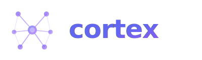

<p align="center">
  
  
  
  
  
  
</p>

<p align="center">
  
</p>

<p align="center">
  <strong>Self-evolving vector memory + agent fleet management for Claude Code</strong>
  <br>
  <em>The first system where Claude Code agents write, evaluate, and reconcile their own agents.</em>
</p>

<p align="center">
  <a href="#-installation">Installation</a> &bull;
  <a href="#-how-it-works">How It Works</a> &bull;
  <a href="#-hook-reference">Hook Reference</a> &bull;
  <a href="#-agent-fleet-management">Fleet Management</a> &bull;
  <a href="#-memory-hygiene">Memory Hygiene</a> &bull;
  <a href="#-mcp-resources">MCP Resources</a> &bull;
  <a href="#-architecture">Architecture</a> &bull;
  <a href="#-safety-guardrails">Safety</a>
</p>

---

## What It Does

cortex gives Claude Code **persistent memory across sessions** and **self-managing agents** that improve over time.

- **Memories** are stored as vector embeddings in ChromaDB and silently injected into Claude's context
- **Agents** are automatically created from accumulated knowledge, evaluated on usage, and retired when obsolete
- **9 hook events** cover the entire session lifecycle — from startup to shutdown
- **Multi-project** aware — memories are scoped per project, agents exist at project and global levels

```
🧠 39 memories (17 project, 15 feedback, 6 reference, 1 user) across 4 projects
🤖 10 agents (5 project + 5 global) | 5 spawns today | health 4.2/5
⚡ loaded 31 memories (session start)
```

---

## Installation

### Prerequisites

| Requirement | Version | Check |
|---|---|---|
| Claude Code | v2.1.9+ | `claude --version` |
| Python | 3.8+ | `python3 --version` |
| pip | any | `pip --version` |

### Step 1: Clone

```bash
git clone https://github.com/digin1/cortex.git ~/.claude/skills/cortex
```

### Step 2: Install Dependencies

```bash
pip install chromadb
```

ChromaDB will also install `onnxruntime` (for embeddings) and `numpy`. No GPU required — CPU embeddings are fast enough.

### Step 3: Initialize Database

```bash
python3 -c "
import chromadb
client = chromadb.PersistentClient(path='$HOME/.claude/cortex-db')
col = client.get_or_create_collection('claude_memories')
print(f'Database initialized: {col.count()} memories')
"
```

### Step 4: Configure MCP Server

Add to your `~/.claude/.mcp.json` (create if it doesn't exist):

```json
{
  "mcpServers": {
    "cortex": {
      "type": "stdio",
      "command": "python3",
      "args": ["-W", "ignore", "/home/YOUR_USERNAME/.claude/skills/cortex/mcp_server.py"]
    }
  }
}
```

Replace `YOUR_USERNAME` with your actual username.

### Step 5: Configure Hooks

Add the following to your `~/.claude/settings.json` (merge with any existing settings):

<details>
<summary><strong>Click to expand full settings.json configuration</strong></summary>

```json
{
  "permissions": {
    "allow": [
      "mcp__cortex__memory_store",
      "mcp__cortex__memory_search",
      "mcp__cortex__memory_list",
      "mcp__cortex__memory_delete",
      "mcp__cortex__memory_update",
      "mcp__cortex__memory_stats"
    ]
  },
  "statusLine": {
    "type": "command",
    "command": "bash ~/.claude/skills/cortex/statusline.sh 2>/dev/null",
    "padding": 0
  },
  "hooks": {
    "UserPromptSubmit": [
      {
        "hooks": [
          {
            "type": "command",
            "command": "bash ~/.claude/skills/cortex/recall.sh 2>/dev/null",
            "statusMessage": "Recalling relevant memories..."
          }
        ]
      }
    ],
    "PreToolUse": [
      {
        "matcher": "mcp__cortex",
        "hooks": [
          {
            "type": "command",
            "command": "bash ~/.claude/skills/cortex/cortex_pretool_enrich.sh 2>/dev/null",
            "statusMessage": "Enriching cortex operation..."
          }
        ]
      }
    ],
    "PostToolUse": [
      {
        "matcher": "Agent",
        "hooks": [
          {
            "type": "command",
            "command": "bash ~/.claude/skills/cortex/agent_track.sh 2>/dev/null",
            "statusMessage": "Tracking agent usage..."
          }
        ]
      }
    ],
    "PreCompact": [
      {
        "hooks": [
          {
            "type": "command",
            "command": "bash ~/.claude/skills/cortex/compact_save.sh 2>/dev/null",
            "statusMessage": "Extracting learnings + managing agent fleet..."
          }
        ]
      }
    ],
    "PostCompact": [
      {
        "hooks": [
          {
            "type": "command",
            "command": "bash ~/.claude/skills/cortex/post_compact_save.sh 2>/dev/null",
            "statusMessage": "Extracting knowledge from compressed context..."
          }
        ]
      }
    ],
    "SubagentStart": [
      {
        "hooks": [
          {
            "type": "command",
            "command": "bash ~/.claude/skills/cortex/agent_context_inject.sh 2>/dev/null",
            "statusMessage": "Injecting cortex context into agent..."
          }
        ]
      }
    ],
    "SessionStart": [
      {
        "hooks": [
          {
            "type": "command",
            "command": "bash ~/.claude/skills/cortex/cleanup.sh 2>/dev/null",
            "statusMessage": "Cleaning stale memory snapshots...",
            "async": true
          }
        ]
      },
      {
        "hooks": [
          {
            "type": "command",
            "command": "bash ~/.claude/skills/cortex/agent_bootstrap.sh 2>/dev/null",
            "statusMessage": "Bootstrapping agents from cortex...",
            "async": true
          }
        ]
      },
      {
        "hooks": [
          {
            "type": "command",
            "command": "bash ~/.claude/skills/cortex/memory_hygiene.sh 2>/dev/null",
            "statusMessage": "Memory hygiene check...",
            "async": true
          }
        ]
      }
    ],
    "SessionEnd": [
      {
        "hooks": [
          {
            "type": "command",
            "command": "bash ~/.claude/skills/cortex/session_end_cleanup.sh 2>/dev/null",
            "statusMessage": "Saving session summary..."
          }
        ]
      }
    ],
    "Stop": [
      {
        "hooks": [
          {
            "type": "command",
            "command": "bash ~/.claude/skills/cortex/learn.sh",
            "statusMessage": "Saving session learnings..."
          }
        ]
      },
      {
        "hooks": [
          {
            "type": "command",
            "command": "bash ~/.claude/skills/cortex/fleet_eval_stop.sh",
            "statusMessage": "Evaluating agent fleet health..."
          }
        ]
      }
    ]
  }
}
```

</details>

### Step 6: Verify Installation

```bash
# Run the test suite
bash ~/.claude/skills/cortex/test.sh

# Check status line
bash ~/.claude/skills/cortex/statusline.sh
```

Then restart Claude Code. You should see the status line at the bottom and memories will start accumulating automatically.

### Quick Install (Alternative)

```bash
bash ~/.claude/skills/cortex/install.sh
```

---

## How It Works

### Session Lifecycle

Every session follows this automatic flow:

```
Session Start
  ├── cleanup.sh          → prune stale data (async)
  ├── agent_bootstrap.sh  → create agents from cortex knowledge (async, daily)
  └── memory_hygiene.sh   → dedup, validate paths, consolidate (async, daily)

Every Message
  └── recall.sh           → inject relevant memories into Claude's context
                            First message: comprehensive project load (all memories)
                            Subsequent: targeted semantic search

Agent Spawned
  ├── agent_context_inject.sh → inject domain memories into the agent
  └── agent_track.sh          → log spawn to usage ledger

Context Compressed
  ├── compact_save.sh     → extract memories from transcript + create/evaluate agents
  └── post_compact_save.sh → extract key insights from the compressed summary

Session Paused
  ├── learn.sh            → prompt Claude to save learnings
  └── fleet_eval_stop.sh  → check agent fleet health (if 5+ spawns today)

Session Ended
  └── session_end_cleanup.sh → save session summary, clean temp files

Every cortex Tool Call
  └── cortex_pretool_enrich.sh → auto-tag project from cwd, log to audit trail
```

### Project-Aware First-Message Recall

On the first message of every session, cortex detects your project from `cwd` and loads **all relevant memories** — not just semantic matches:

| Category | What's loaded | Why |
|---|---|---|
| User profile | Always | Who you are, how you work |
| Feedback | Always (all projects) | Cross-project rules and preferences |
| Project context | Matching project + global | Architecture, decisions, gotchas |
| References | Matching project + global | File paths, commands, endpoints |
| Semantic matches | From your first prompt | Cross-project hits |

Subsequent messages use targeted semantic search with a relaxed threshold for current-project memories.

### Silent Context Injection

Memories are injected via Claude Code's `additionalContext` API — Claude sees them, you don't:

```json
{
  "suppressOutput": true,
  "hookSpecificOutput": {
    "hookEventName": "UserPromptSubmit",
    "additionalContext": "[cortex] Session context loaded for project: my-project\n..."
  }
}
```

### Agent Context Injection

When any subagent spawns, the `SubagentStart` hook queries cortex for memories relevant to that agent type and injects them. A `dask-optimizer` agent automatically gets Dask-related memories; a `swarm-deployer` gets deployment knowledge.

---

## Hook Reference

| Hook Event | Script | Sync/Async | What It Does |
|---|---|---|---|
| `UserPromptSubmit` | `recall.sh` | Sync | Inject memories into Claude's context |
| `PreToolUse` | `cortex_pretool_enrich.sh` | Sync | Auto-tag project + audit log for cortex ops |
| `PostToolUse(Agent)` | `agent_track.sh` | Sync | Track agent spawns in usage ledger |
| `SubagentStart` | `agent_context_inject.sh` | Sync | Inject domain memories into spawned agents |
| `PreCompact` | `compact_save.sh` | Sync | Extract memories + create/evaluate agents |
| `PostCompact` | `post_compact_save.sh` | Sync | Extract insights from compressed summary |
| `SessionStart` | `cleanup.sh` | Async | Prune stale data |
| `SessionStart` | `agent_bootstrap.sh` | Async | Bootstrap agents from cortex (daily) |
| `SessionStart` | `memory_hygiene.sh` | Async | Dedup, path validation, consolidation (daily) |
| `SessionEnd` | `session_end_cleanup.sh` | Sync | Save session summary + cleanup |
| `Stop` | `learn.sh` | Sync | Prompt Claude to save learnings |
| `Stop` | `fleet_eval_stop.sh` | Sync | Lightweight fleet health check |

---

## Agent Fleet Management

### Automatic Agent Creation

Agents are created from two sources:

1. **Bootstrap** (`SessionStart`): Queries cortex for accumulated knowledge. If a project has 3+ memories but fewer than 2 agents, it uses `claude -p --model haiku` to propose new agents. Runs once per project per day.

2. **Compact** (`PreCompact`): Analyzes the conversation transcript for recurring patterns. Creates 0-5 agents per compaction event with semantic dedup (cosine < 0.55).

### Agent Evaluation & Reconciliation

On every PreCompact, the system:
- **Scores** each agent 1-5 based on relevance, quality, and usage data
- **Updates** agents with stale instructions (creates `.bak` backup first)
- **Retires** low-scoring agents (extracts knowledge to cortex, moves to `.retired/`)

### Persistent Agent Memory

All agents have the `memory:` field in their frontmatter:

```yaml
---
name: dask-optimizer
memory: project    # project agents use project scope
---

---
name: data-safety-ops
memory: user       # global agents use user scope
---
```

This means agents **accumulate knowledge across sessions** in their own `MEMORY.md` files.

### Fleet Health

| Metric | How it's tracked |
|---|---|
| Usage count | JSONL ledger (`~/.claude/agent-usage.jsonl`) |
| Eval scores | Stored in cortex as `agent_eval` type memories |
| Health status | Based on score + 7-day usage |
| Fleet dashboard | Run `/cortex agents` for full report |

### Hard Caps

| Limit | Value | Purpose |
|---|---|---|
| Max project agents | 5 | Prevent scope creep |
| Max global agents | 5 | Prevent scope creep |
| Semantic dedup threshold | 0.55 | Prevent duplicate agents |
| Bootstrap per day | 1 per project | Prevent repeated creation |
| Agents per batch | 3 (bootstrap), 5 (compact) | Conservative creation |

---

## Memory Hygiene

The hygiene system runs daily on `SessionStart` (async) with 4 phases:

### Phase 1: Duplicate Detection
Finds memory pairs with cosine distance < 0.35 within the same type. Keeps the longer/more detailed version, merges tags, records `merged_from` metadata.

### Phase 2: Path Validation
Extracts file paths from memory content and checks if they still exist on the filesystem. Flags broken paths with `stale_path` tag. Skips NAS mounts (`/remote/`) and container paths (`/app/`). **Never deletes** — only flags.

### Phase 3: Recall Tracking
Reads the recall log (`~/.claude/.cortex_recall_log`) and updates each memory's `last_recalled` timestamp and `recall_count`. This data informs future hygiene decisions.

### Phase 4: Consolidation
For groups of 3+ related memories in the same project, uses `claude -p --model haiku` to merge them into 1 comprehensive memory. Only runs when 15+ total memories exist. Originals are deleted only after successful consolidation.

---

## MCP Resources

The MCP server exposes resources that can be referenced with `@` in the Claude Code prompt:

| Resource URI | What It Returns |
|---|---|
| `memory://all` | All memories with type, project, and content preview |
| `memory://{memory_id}` | Full content and metadata for a specific memory |
| `memory://project/{name}` | All memories scoped to a project |
| `memory://type/{type}` | All memories of a specific type (feedback, project, etc.) |

### MCP Tools

| Command | Description |
|---|---|
| `/cortex store <content>` | Store a new memory |
| `/cortex search <query>` | Semantic search across all memories |
| `/cortex list` | List all memories |
| `/cortex stats` | Database statistics |
| `/cortex delete <id>` | Delete a memory (archived to audit log) |
| `/cortex update <id>` | Update a memory |
| `/cortex agents` | Fleet health dashboard |
| `/cortex learn` | Review session and extract learnings to memory |

---

## Memory Types

| Type | What | Example |
|---|---|---|
| `user` | User profile and role | *"Senior engineer, prefers terse responses"* |
| `feedback` | User corrections and preferences | *"Always use step=any on auto-calculated number inputs"* |
| `project` | Technical decisions and architecture | *"Docker Swarm --force reuses cached image, must use --image"* |
| `reference` | File paths, URLs, commands | *"GitLab API at git.example.com, token in config"* |

---

## Architecture

```
~/.claude/
├── skills/cortex/
│   ├── recall.sh                  # UserPromptSubmit: project-aware context injection
│   ├── cortex_pretool_enrich.sh     # PreToolUse: auto-tag project + audit
│   ├── agent_context_inject.sh    # SubagentStart: inject domain memories into agents
│   ├── compact_save.sh            # PreCompact: extract memories + fleet management
│   ├── post_compact_save.sh       # PostCompact: extract from compressed summary
│   ├── agent_bootstrap.sh         # SessionStart: create agents from cortex knowledge
│   ├── memory_hygiene.sh          # SessionStart: dedup, validate, consolidate
│   ├── cleanup.sh                 # SessionStart: prune stale data
│   ├── learn.sh                   # Stop: prompt to save learnings
│   ├── fleet_eval_stop.sh         # Stop: lightweight fleet health check
│   ├── session_end_cleanup.sh     # SessionEnd: save summary + cleanup
│   ├── agent_track.sh             # PostToolUse(Agent): log spawns
│   ├── agent_dashboard.py         # /cortex agents command
│   ├── statusline.sh              # Multi-line status bar
│   ├── mcp_server.py              # MCP server: 6 tools + 4 resources
│   ├── memory_db.py               # ChromaDB CLI wrapper
│   ├── SKILL.md                   # Skill definition for /cortex
│   ├── test.sh                    # Test suite
│   └── lib/
│       ├── parse_transcript.py    # Transcript JSONL parser
│       ├── store_memories.py      # Memory storage with dedup
│       ├── memory_hygiene.py      # Dedup, path validation, consolidation
│       ├── collect_memories_full.py # Full memory collector (for bootstrap)
│       ├── fleet_create.py        # Agent creation with semantic dedup + hard caps
│       ├── fleet_eval.py          # Agent evaluation, update, retire
│       ├── collect_agents.py      # Agent inventory collector
│       ├── collect_usage.py       # Usage ledger reader
│       └── collect_memories.py    # ChromaDB memory reader
├── cortex-db/              # ChromaDB persistent storage
├── agent-usage.jsonl              # Agent spawn ledger
├── .cortex_activity                 # Live activity indicator
├── .cortex_audit.jsonl              # Audit trail for all memory operations
├── .cortex_recall_log               # Recall tracking for hygiene
├── .cortex_ops_log.jsonl            # PreToolUse operation log
├── .cortex_sessions.jsonl           # Session start/end markers
└── agents/
    ├── *.md                       # Active global agents (memory: user)
    └── .retired/                  # Soft-retired agents
```

Project-level agents live at `<project>/.claude/agents/*.md` with `memory: project`.

---

## Safety Guardrails

| Protection | Implementation |
|---|---|
| **Content size limit** | Max 5000 chars per memory |
| **Database cap** | Max 200 total memories |
| **Audit trail** | All store/update/delete operations logged to `.cortex_audit.jsonl` |
| **Soft delete** | Deleted memory content archived to audit log before removal |
| **Merge tracking** | Merged memories tagged with `merged_from` ID |
| **Consolidation tracking** | Consolidated memories tagged with `consolidated_from` IDs |
| **No age-based deletion** | Memories never removed for being old (designed for long-running projects) |
| **Path validation** | Broken file paths flagged, never auto-deleted |
| **Agent path traversal** | `os.path.realpath()` + directory whitelisting |
| **Agent hard caps** | Max 5 project + 5 global agents |
| **Agent filename sanitization** | Only `[a-z0-9\-_.]` allowed |
| **Semantic dedup** | 0.55 threshold for agents, 0.15 for memories, 0.35 for hygiene merges |
| **Backup before update** | Timestamped `.bak` files before agent overwrites |
| **Soft retire** | Agents moved to `.retired/` with knowledge extracted to cortex |
| **Daily cooldowns** | Bootstrap + hygiene run max once per project per day |
| **Operation logging** | Every cortex tool call logged via PreToolUse hook |
| **Auto project tagging** | PreToolUse enriches memory_store with project from cwd |

---

## Requirements

| Requirement | Version | Notes |
|---|---|---|
| Claude Code | v2.1.9+ | Needs `additionalContext` + `SubagentStart` hook support |
| Python | 3.8+ | For ChromaDB and hook scripts |
| chromadb | Latest | `pip install chromadb` |
| claude CLI | Latest | For `claude -p` in compact/bootstrap/hygiene |

### Platform Support

| Platform | Status | Notes |
|---|---|---|
| Linux | Fully supported | Primary development platform |
| macOS | Fully supported | `stat` differences handled |
| Windows | Via Git Bash / WSL | Requires bash environment |

---

## Contributing

Contributions welcome! Areas of interest:

- **Recall caching** — daemon process to avoid ChromaDB cold-start on every prompt
- **Cross-project federation** — share agents between projects intelligently
- **Fleet analytics** — usage trends, score degradation alerts, visualizations
- **Hybrid search** — combine vector + keyword (BM25/FTS5) for better recall
- **Plugin packaging** — convert to official Claude Code plugin format

---

## License

[MIT](LICENSE)

---

<p align="center">
  <em>Built with care by <a href="https://github.com/digin1">@digin1</a></em>
  <br>
  <sub>If this saves you context, give it a star</sub>
</p>
